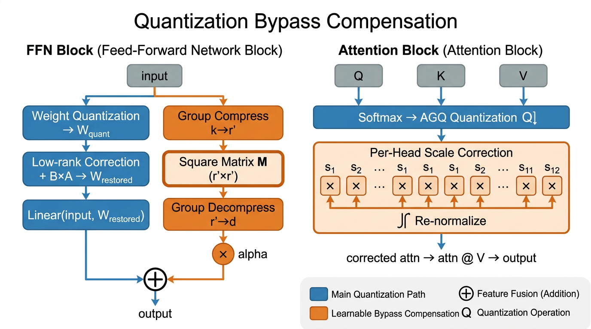

# BAQ: Bypass-Aware Quantization for Segment Anything Model

[Anonymous Authors]

**BAQ** is a post-training quantization (PTQ) framework for Segment Anything Model (SAM) that explicitly compensates for **structure-aware information loss** through lightweight learnable bypass modules. Built on top of PTQ4SAM, BAQ addresses the limitations of existing PTQ methods by recovering low-rank structure in FFN layers, modeling activation quantization residuals, and calibrating per-head attention distributions.

## Overview



Segment Anything Model (SAM) demonstrates powerful zero-shot capabilities but suffers from high computational cost, making deployment on edge devices challenging. Existing PTQ methods exhibit limitations when applied to SAM, primarily due to SAM's hybrid attention mechanisms and complex activation distributions.

We identify that low-bit quantization causes **structure-aware information loss** beyond conventional quantization error, including:

- Disrupted low-rank structure in feed-forward network (FFN) layers
- Per-head heterogeneity in attention distributions

To address these issues, BAQ introduces three lightweight learnable compensation modules:

1. **Low-Rank Bypass Compensation (LRBC)** — Restores FFN weight structure via low-rank corrections
2. **Modulated Residual Adapter (MoRA)** — Models activation quantization residuals through group-wise compression-decomposition
3. **Per-Head Dynamic Calibration (PHDC)** — Adapts quantized attention distributions at the head level

## Results

### Instance Segmentation on COCO val2017 (SAM-B + YOLOX)

| Method | FP | W6A6 | W4A4 |
|--------|:--:|:----:|:----:|
| PTQ4SAM-S | 37.0 | 17.4 | 1.2 |
| QDrop | 37.0 | 33.6 | 13.3 |
| PTQ4SAM-L | 37.0 | 34.3 | 18.4 |
| **BAQ (Ours)** | **37.0** | **35.9** | **20.1** |

### Semantic Segmentation on ADE20K (SAM-B + SegFormer)

| Method | FP | W6A6 | W4A4 |
|--------|:--:|:----:|:----:|
| QDrop | 33.15 | 32.57 | 31.79 |
| PTQ4SAM-L | 33.15 | 32.65 | 31.85 |
| **BAQ (Ours)** | **33.15** | **33.05** | **32.45** |

## Create Environment

You can refer to `environment.sh` in the root directory or install step by step.

1. Install PyTorch

```
conda create -n baq python=3.7 -y
pip install torch torchvision
```

2. Install MMCV

```
pip install -U openmim
mim install "mmcv-full<2.0.0"
```

3. Install other requirements

```
pip install -r requirements.txt
```

4. Compile CUDA operators

```
cd projects/instance_segment_anything/ops
python setup.py build install
cd ../../..
```

5. Install mmdet

```
cd mmdetection/
python3 setup.py build develop
cd ..
```

## Prepare Dataset and Models

Download the official COCO dataset and organize as follows:

```shell
├── data
│   ├── coco
│   │   ├── annotations
│   │   ├── train2017
│   │   ├── val2017
│   │   ├── test2017
```

Download pretrain weights to `ckpt/`:

- `sam_b`: [ViT-B SAM](https://dl.fbaipublicfiles.com/segment_anything/sam_vit_b_01ec64.pth)
- `sam_l`: [ViT-L SAM](https://dl.fbaipublicfiles.com/segment_anything/sam_vit_l_0b3195.pth)
- `sam_h`: [ViT-H SAM](https://dl.fbaipublicfiles.com/segment_anything/sam_vit_h_4b8939.pth)
- `faster rcnn`: [R-50-FPN Faster R-CNN](https://download.openxlab.org.cn/models/mmdetection/FasterR-CNN/weight/faster-rcnn_r50_fpn_2x_coco)
- `yolox`: [YOLOX-l](https://download.openmmlab.com/mmdetection/v2.0/yolox/yolox_l_8x8_300e_coco/yolox_l_8x8_300e_coco_20211126_140236-d3bd2b23.pth)
- `detr`: [H-Deformable-DETR](https://github.com/HDETR/H-Deformable-DETR/releases/download/v0.1/r50_hybrid_branch_lambda1_group6_t1500_dp0_mqs_lft_deformable_detr_plus_iterative_bbox_refinement_plus_plus_two_stage_36eps.pth)
- `dino`: [DINO](https://projects4jw.blob.core.windows.net/focalnet/release/detection/focalnet_large_fl4_o365_finetuned_on_coco.pth)

## Usage

### Basic Quantization

To perform BAQ quantization with MoRA bypass, specify the model configuration and quantization configuration:

```bash
python ptq4sam/solver/test_quant.py \
  --config ./projects/configs/yolox/yolo_l-sam-vit-b.py \
  --q_config exp/config66_mora.yaml \
  --quant-encoder
```

- `yolo_l-sam-vit-b.py`: configuration file for SAM-B with YOLOX detector
- `config66_mora.yaml`: W6A6 quantization with MoRA bypass (recommended)
- `quant-encoder`: quantize the encoder of SAM

### Quantization Configurations

The quantization config files in `exp/` control all aspects of BAQ:

| Config | Bit-width | Bypass | Description |
|--------|-----------|--------|-------------|
| `config66.yaml` | W6A6 | MoRA | BAQ with MoRA bypass |
| `config66_mora.yaml` | W6A6 | MoRA+DIAGQ | Full BAQ with MoRA and DIAGQ |
| `config44.yaml` | W4A4 | - | Low-bit baseline |

### Bypass Module Control

The YAML config supports toggling each bypass module:

```yaml
ptq4sam:
  # MoRA Module
  mora_config:
    enabled: True                # enable/disable MoRA bypass
    rank: 256                    # bypass rank
    alpha: 0.5                   # bypass scaling factor

  # DIAGQ (DFQ + AGQ fusion for Softmax)
  DIAGQ: True                    # use dynamic interval AGQ
  AGQ: False                     # disable original AGQ
  BIG: True                      # bimodal integration
```

We recommend using a GPU with more than 40GB for experiments.

## Project Structure

```
├── ptq4sam/                     # Core quantization library
│   ├── quantization/
│   │   ├── mora_adapter.py      # MoRA bypass layer
│   │   ├── quantized_module.py  # QLinearMoRA quantized layer
│   │   ├── dynamic_interval_quantizer.py  # DIAGQ (DFQ+AGQ fusion)
│   │   ├── fake_quant.py        # Fake quantize implementations
│   │   └── observer.py          # Quantization observers
│   ├── model/
│   │   └── quant_model.py       # Quantized model definition
│   └── solver/
│       ├── test_quant.py        # Main evaluation script
│       ├── quant_coco.py        # COCO quantization pipeline
│       └── recon.py             # Reconstruction optimization
├── exp/                         # Quantization config files
├── projects/                    # Model configurations
├── mmdetection/                 # MMDetection framework
├── test_quant.py                # Root-level entry script
└── recon.py                     # Root-level reconstruction
```

## Reference

If you find this repo useful for your research, please consider citing:

```
@article{baq2025,
  title={Bypass-Aware Quantization: Compensating Structure Loss in Post-Training Quantization for Segment Anything Model},
  author={Anonymous Authors},
  journal={Under Review},
  year={2025}
}
```

## Acknowledgments

This codebase is built upon [PTQ4SAM](https://github.com/chengtao-lv/PTQ4SAM) (CVPR 2024), [Prompt-Segment-Anything](https://github.com/RockeyCoss/Prompt-Segment-Anything), and [QDrop](https://github.com/wimh966/QDrop). We thank the authors for their open-source contributions.
